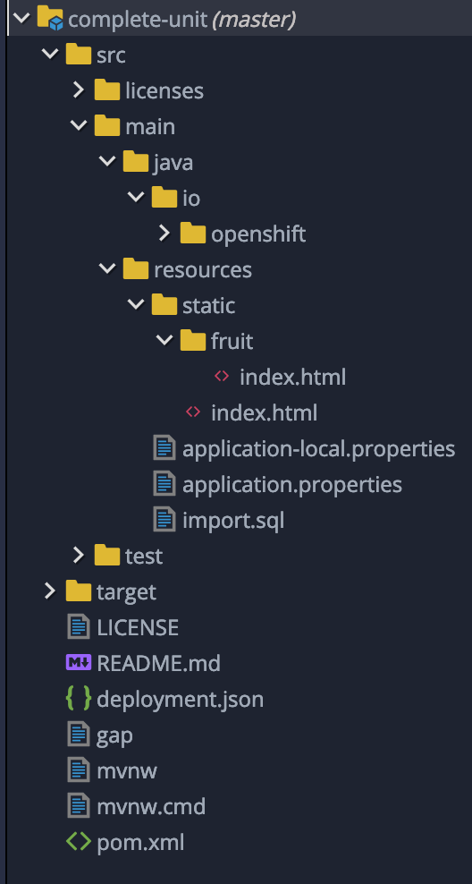
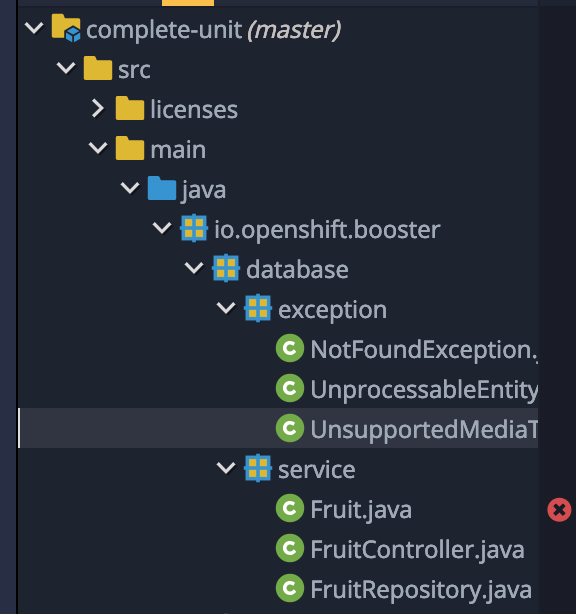
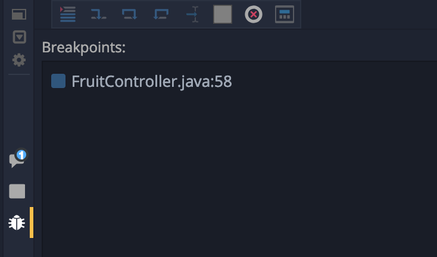
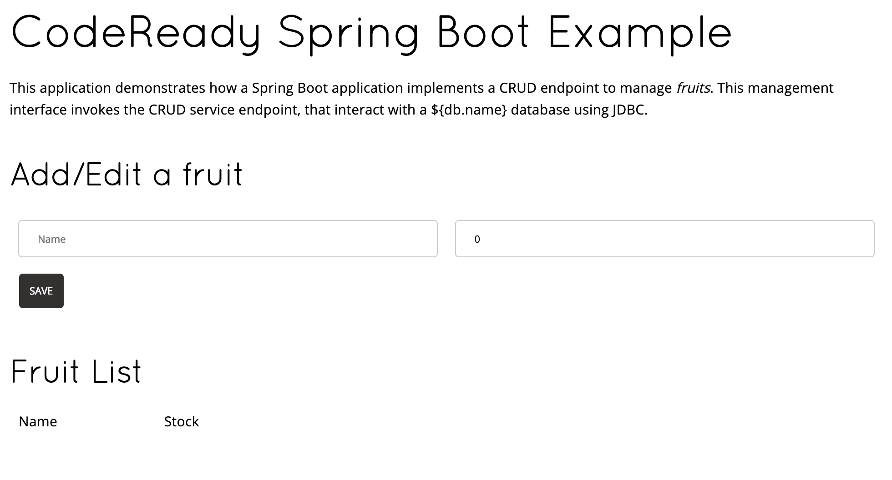
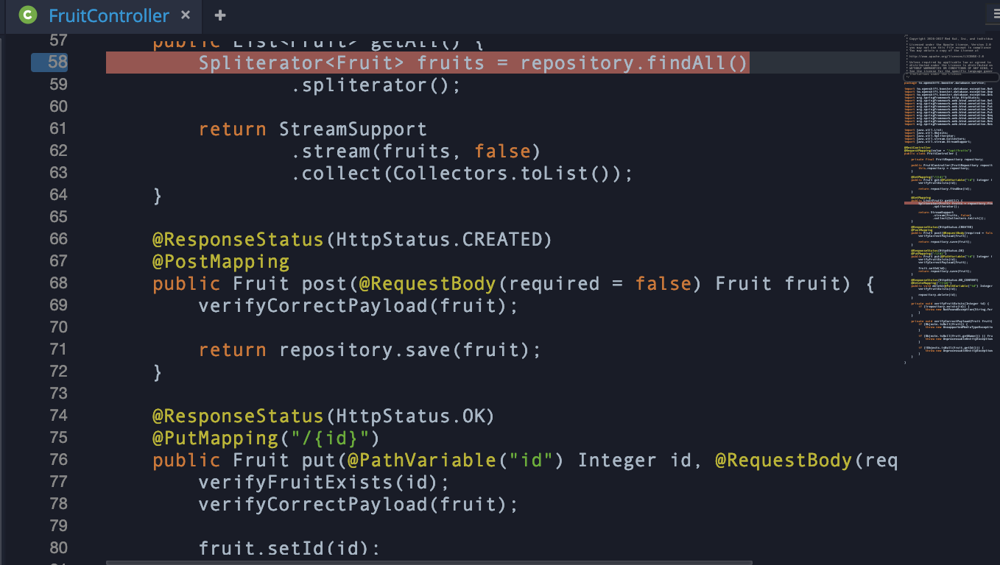
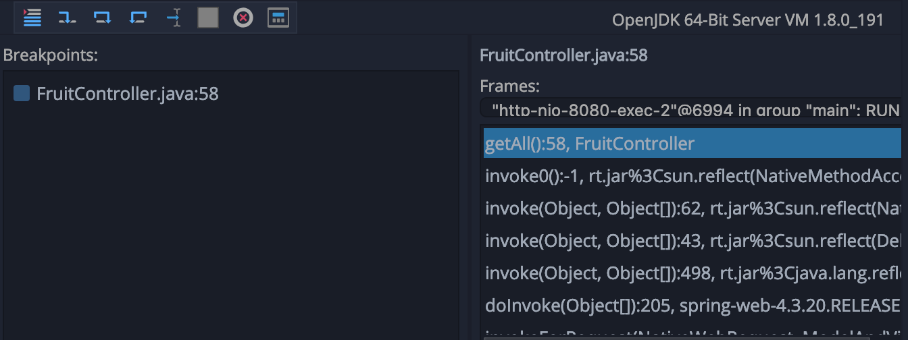

## Debugging Application in CodeReady Workspaces

### Prerequisites
* An application is already configured into a CodeReady Workspace 

### Set up Java Project Configuration
If you look at the Project browser, the view is currently blank and it appears as shown below:



Let us first change the view to Java project view. To change the view navigate to `Project`->`Update Project Configuration`

And in the resulting `Project Configuration` menu select `Java`->`Maven` and click on the `Save` button.

You will notice that this will change the view to Java view as below. You may have to refresh the project browser.


### Add Debug Maven Command

We will use the same approach like how we added the `build and run` command earlier

* Switch to command view on the project explorer
* Click on the `+` symbol next to `Debug` and select `Maven` type
* Name the command `debug`
* Replace the Command Line with the following content:
	* Most of the options are same as the `build and run` command we added previously
	* We are passing extra parameters in `run.jvmArguments` to open up port `4005` to connect the debugger to. You can change the port if you wish to.
 ```
 MAVEN_OPTS='-Xmx500m' && mvn -f ${current.project.path}/pom.xml spring-boot:run -Plocal -Drun.profiles=local -Drun.jvmArguments="-agentlib:jdwp=transport=dt_socket,server=y,suspend=y,address=4005"
```

* Set the `previewURL` value to `${server.springboot}/fruit/index.html` 
* Click the `Save` button to save this maven command

### Debug Configuration

One more step before we start debugging

* Navigate to menu `Run`->`Edit Debug Configurations`. This will open up `Debug Configuration` window.
* Click on the `+` next to Java, and select `Remote Java`. This opens the debug configuration for remote java.
* This configuration will be connecting to `localhost` on port `8000`. Change the port to `4005` as our runtime will listen on this port for debugging based on our previous configuration
* Click on `Save` button to save this configuration and `Close` the debug configuration window.

### Code Fixes (Temporary)

There are a few issues with this generated code currently, and these should be fixed soon. In the meanwhile, let us fix these ourselves.

Navigate the source code in Project Explorer to `io.openshift.booster`->`database` package as shown below



You will find two packages `service` and `exception` here. If you look at the code in these two packages every file has package set to 

`package io.openshift.booster.exception;`

You will notice this marked with a red `x` next to that line indicating an error.  Right click on the line to find `Quick Fix`. 


Follow the quick fix, double click on it to change that line to 

`package io.openshift.booster.database.exception;`

This change should be done in all the files under `database` package

`Fruit.java`, `FruitController.java` and `FruitRepository.java` in the service package and `NotFoundException.java`, `UnprocessableEntityException.java` and `UnsupportedMediaTypeException.java` in the exception package.

You'll also have to fix their references in other parts of code. Navigate to `test`->`java`->`io.openshift.booster`->`BoosterApplicationIT.java`

Once you make these changes and fix all the dependencies you would want to `build and run` once to make sure that the code runs successfully.

Once you complete testing remember to close the `build and run` terminal so that we can run `debug` next

### Debug code 

* Open `FruitController.java` and find `getAll()` method. Click on the line number  at the first line inside that method to set a breakpoint as shown below.


* Invoke `debug` command from command palette. This will start a debug terminal, build code and attach an agent. You will see the control waits with the following messages in the debug terminal

```
...
...
...
[INFO] Attaching agents: []
Listening for transport dt_socket at address: 4005
```
So the runtime is now listening at `4005` on the localhost and we are ready to connect to it.

Now select from menu choose `Run`->`Debug`->`Remote Java`


This will now try to connect to debug host and in a few seconds you'll see a message that the connection is successful

You will also see a debug view which also shows breakpoints as below. The breakpoint you set in the `Fruitcontroller.java` should be listed in there. Also notice the yellow line next to the bug icon that shows you are in the debug view.



Switch over to the terminal view by clicking on the square box icon above the bug icon.

Your debug terminal should show the rest of the logs now and eventually it should start your application as below

```
...
...
...
2019-03-06 20:24:26.064  INFO 1527 --- [  restartedMain] o.s.j.e.a.AnnotationMBeanExporter        : Registering beans for JMX exposure on startup
2019-03-06 20:24:26.105  INFO 1527 --- [  restartedMain] o.s.c.support.DefaultLifecycleProcessor  : Starting beans in phase 0
2019-03-06 20:24:26.503  INFO 1527 --- [  restartedMain] s.b.c.e.t.TomcatEmbeddedServletContainer : Tomcat started on port(s): 8080 (http)
2019-03-06 20:24:26.519  INFO 1527 --- [  restartedMain] io.openshift.booster.BoosterApplication  : Started BoosterApplication in 42.843 seconds (JVM running for 232.627)
```

Once your application is started, click on the preview URL in the debug terminal to bring up the application in the browser. You'll notice that while the screen comes up, the fruit list is not displayed. 



This is because the control is waiting at the breakpoint.



Switch to the debug view if you are not already in there by clicking on the bug icon.



Try the buttons StepInto, StepOver, StepOut, Resume on the top of the debug menu above Breakpoints view. 


### Summary

In this lab we have learnt to set up a debug command, create a remote connection and did step by step debugging.


